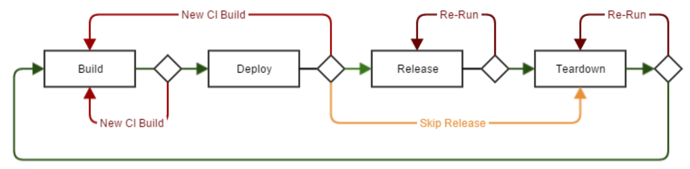

============
Introduction
============

What is the github actions pipeline?
=====================================
The github actions pipeline is a CICD tool for building, deploying, and managing the lifecycle of applications using simple YAML format.

What does the actions pipeline do for me?
==========================================

Infrastructure-as-Code
======================
